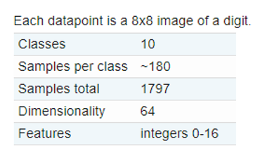
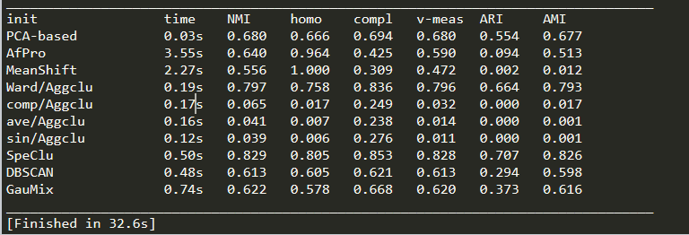

# 实验一：聚类
---
本次实验采用了多种聚类算法，分别对手写数字数据和文档数据进行了聚类实验，并根据不同的评价标准对结果进行了评价和对比，下面会分别介绍两个实验的过程和结果。
## 手写数据聚类
首先是对手写数据集的聚类，该数据集的详细信息如下图1所示

数据集一共包含十个类，每个样本有64个维度，我一共采用了Kmeans、AffinityPropagation、MeanShift、SpectralClustering、AgglomerativeClustering、DBSCAN和GaussianMixture这几种方法进行聚类，其中AgglomerativeClustering具体分为Ward/complete/average/single这四类方法。聚类的结果图如下所示

从实验结果图中可以看出SpectralClustering方法的结果在各项指标上都优于其他方法，而AgglomerativeClustering中的single和average方法效果则不是很好，这点从报告最后我贴出了二维可视化结果图也可看出。
实验中遇到的主要问题就是不同方法的参数和方法都不大相同，例如一些方法没有labels_方法，但可以使用.predict(data)代替。另外就是有些聚类方法结果也受参数影响，例如DBSCAN方法中的eps参数代表两个邻域之间两个样本的最大距离，不同的eps对结果有很大的影响，由于时间原因我尝试了一部分参数并选择了结果相对较好的参数，结果或许还可以继续优化。

---
## 文档数据聚类
文档数据集详细信息如下图所示

本次实验中我们仅取了这20个类中的alt.atheism, talk.religion.misc, comp.graphics, sci.space 4类。文档数据聚类大体上和手写数据集聚类差不多，但由于数据量和样本维度过大，直接采用原始数据进行聚类所消耗的时间会很长。因此我采用了SVD对原始数据进行降维提取重要特征，这样不仅可以让聚类时间大幅下降，还可以保证聚类的效果。下面的图分别是不降维，提取50维特征和提取100维特征的结果图。在和同学们的讨论中得知SVD降维的explained_variance即解释性差异一定程度上可以反映降维信息的保存度量，因此后来我额外加了1500维和2000维度的实验结果图如下所示。从结果来看，确实在某些聚类方法上(例如SpectralClustering)可以取得更佳的结果

50维：

100维：

1500维：

2000维：

## 附录：手写数据集可视化结果

